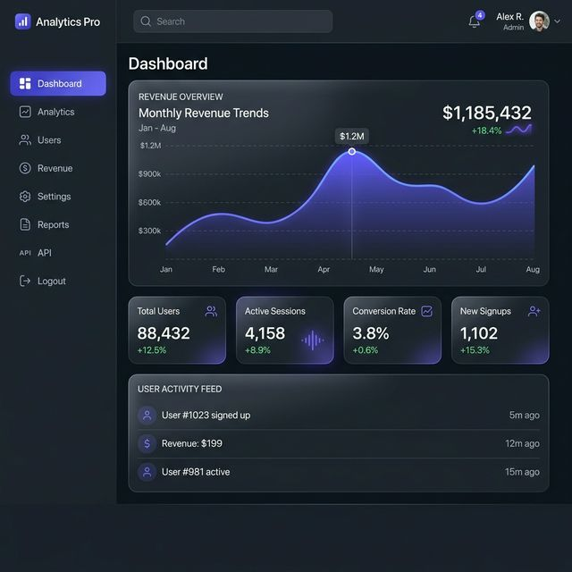

# 🚀 Admin Analytics Dashboard

<p align="center">
  
</p>

A modern admin dashboard for visualizing business data, managing users, and exploring analytics through a clean and interactive interface.

🔗 Live Demo: https://your-link.vercel.app  
📂 GitHub: https://github.com/erichhfromm/Admin-Analytics-Dashboard

---

## ✨ Overview
**Admin Analytics Dashboard** is a fullstack web application built to simulate a real-world admin system. It focuses on data visualization, user management, and responsive UI design.

This project demonstrates how modern web applications handle structured data, authentication, and interactive dashboards using current frontend and backend technologies.

---

## 🛠️ Features
- 🔐 Authentication system using JWT  
- 👥 User management dashboard  
- 📊 Interactive data visualization  
- 💬 Basic internal messaging UI  
- 📄 Pagination for handling large datasets  
- 🌓 Dark & Light mode  
- 📱 Fully responsive design  

---

## 💻 Tech Stack

**Frontend:**
- React.js (Vite)
- Tailwind CSS
- Recharts
- Framer Motion

**Backend:**
- Node.js
- Express.js
- JWT Authentication
- Bcrypt

**Database:**
- MongoDB (Mongoose)

---

## 🚀 Getting Started

### Requirements
- Node.js (v18+)
- MongoDB

### Installation

```bash
git clone https://github.com/erichhfromm/Admin-Analytics-Dashboard.git

npm install

cd backend
npm install

### Environment Setup
Create a .env file in the /backend directory:
PORT=5000
MONGO_URI=mongodb://localhost:27017/admin-analytics-dashboard
JWT_SECRET=adminDashboardSecret123!

### Database Seeding
Initialize the Super Admin account:
cd backend
npm run seed:admin
Default Credentials:
Email: admin@example.com
Password: password123

### Running the Application
# Start Backend
cd backend
npm run dev

# Start Frontend
npm run dev

### Key Learning Points
Building a fullstack dashboard with React & Node.js
Implementing authentication using JWT
Managing data using MongoDB
Designing responsive and user-friendly UI

### Future Improvements
Real-time data updates (WebSocket)
Advanced filtering and analytics
Full deployment with backend integration
Enhanced role-based access control

### Author
Erik Suroso
Frontend Developer (Open to Remote Opportunities)

⭐ Support
If you like this project, feel free to give it a star ⭐
